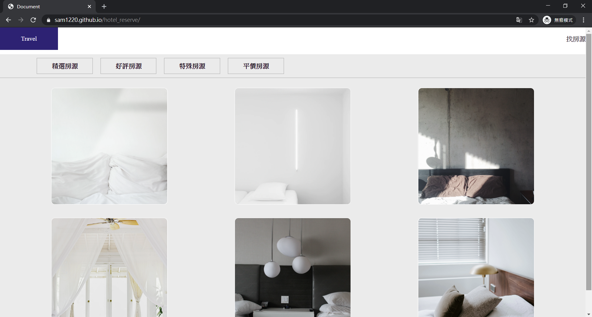
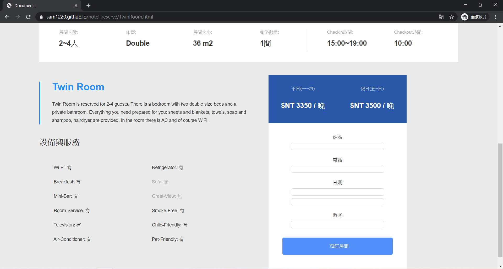

# hotel_reserve

## 簡介:以javascript進行資料串接渲染html呈現資訊予使用者，並讓使用者可於個別房型頁面做預訂。

## 使用技術:
* 1.使用fetch進行資料串接。
* 2.以localstorage儲存資料進行後續資料判斷。
* 3.載入datepocker套件做日期選取，以利將日期post至api中處理。

function:
* 1.使用者可於首頁看到所有房型及基本資訊。
* 2.在單一房型頁面中可以看到更詳細的房型資訊。
* 3.能夠進行房間預訂。

## 畫面預覽:

### 首頁

### 預訂

